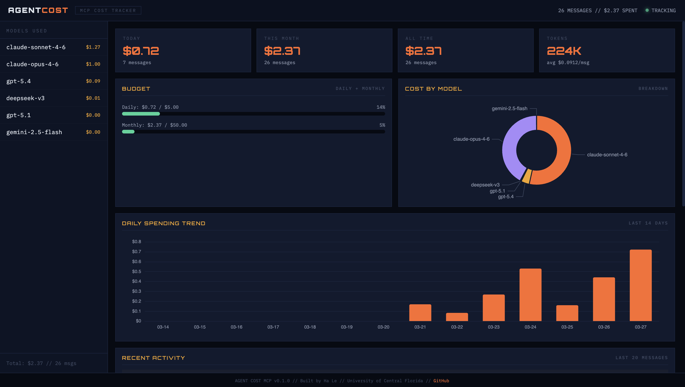
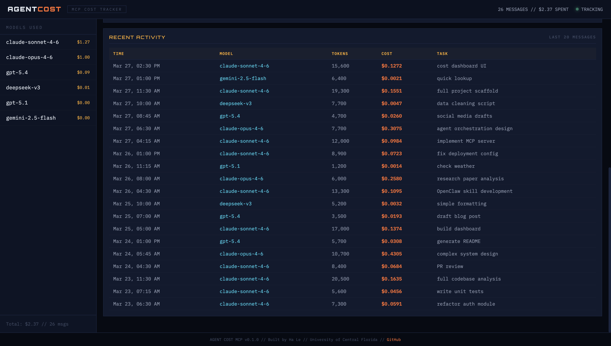

# agent-cost-mcp

MCP server that tracks AI agent token usage and spending in real time. Budget alerts, per-task cost breakdown, visual dashboard, daily/weekly/monthly reports.

Works with any MCP client: **Claude Code, Cursor, Windsurf, Codex, Gemini CLI**, and more.

[](LICENSE)
[](https://python.org)
[](https://modelcontextprotocol.io)





## Why?

Every developer using AI agents worries about spending. Most tools don't tell you what each message costs until the bill arrives.

This MCP server tracks it in real time — per message, per model, per day. Set a budget, get alerts, see exactly where your money goes.

## Features

- **Visual dashboard** — dark-themed web UI with spending charts, budget gauges, and activity log
- **Per-message cost logging** — see what each AI interaction costs instantly
- **Budget alerts** — warns when approaching daily/monthly limits
- **Cost reports** — today, this week, this month, all time
- **Model breakdown** — donut chart showing which model eats your budget
- **Spending trends** — 14-day bar chart with color-coded spending
- **15+ models supported** — Claude, GPT, DeepSeek, Gemini, Llama
- **Estimate before running** — check cost before expensive tasks
- **Local storage** — all data stays on your machine (`~/.agent-cost-mcp/`)
- **Auto-refresh** — dashboard updates every 30 seconds

## Quick Start

### 1. Install

```bash
pip install agent-cost-mcp
```

Or with uv:
```bash
uv pip install agent-cost-mcp
```

### 2. Add to your AI tool

**Claude Code** — add to `~/.claude/settings.json`:
```json
{
  "mcpServers": {
    "agent-cost": {
      "command": "agent-cost-mcp"
    }
  }
}
```

**Cursor** — add to `.cursor/mcp.json`:
```json
{
  "mcpServers": {
    "agent-cost": {
      "command": "agent-cost-mcp"
    }
  }
}
```

**Windsurf** — add to MCP config:
```json
{
  "mcpServers": {
    "agent-cost": {
      "command": "agent-cost-mcp"
    }
  }
}
```

### 3. Open the dashboard

```bash
open dashboard.html
```

Or serve it locally:
```bash
cd ~/.agent-cost-mcp && python3 -m http.server 3456
# Open http://localhost:3456/dashboard.html
```

The dashboard reads from `~/.agent-cost-mcp/cost-log.json` and auto-refreshes every 30 seconds. Leave it open in a browser tab while you work.

## MCP Tools

These tools are available to any connected MCP client:

| Tool | What it does | Example |
|------|-------------|---------|
| `log_cost` | Log token usage and cost for a task | `log_cost(model="claude-sonnet-4-6", tokens_in=1500, tokens_out=800, task="code review")` |
| `cost_report` | Get spending report | `cost_report(period="today")` — also: `week`, `month`, `all` |
| `set_budget` | Set daily/monthly budget limits | `set_budget(daily_limit=5.00, monthly_limit=50.00)` |
| `cost_trend` | Show daily spending chart | `cost_trend(days=7)` |
| `estimate_cost` | Estimate cost without logging | `estimate_cost(model="claude-opus-4-6", tokens_in=5000, tokens_out=3000)` |
| `supported_models` | List all models + pricing | `supported_models()` |

## How It Works

```
You use Claude Code / Cursor / Windsurf normally
        ↓
MCP server logs each interaction (model, tokens, cost)
        ↓
Data saved to ~/.agent-cost-mcp/cost-log.json
        ↓
Dashboard reads the JSON and shows charts
        ↓
Budget alerts warn you before you overspend
```

The MCP server runs as a background process alongside your AI tool. You don't need to do anything extra — it tracks automatically when tools call `log_cost`.

## Example Session

```
> How much did that last message cost?
Logged: $0.0165 (1,500 in / 800 out, claude-sonnet-4-6)

> Show my spending for today
# Cost Report — Today (2026-03-27)
- Messages: 26
- Tokens: 187,000 (118,000 in / 69,000 out)
- Total cost: $2.14
- Avg cost/message: $0.082

## By Model
  claude-opus-4-6: $0.99 (46%)
  claude-sonnet-4-6: $0.93 (43%)
  gpt-5.4: $0.19 (9%)
  deepseek-v3: $0.01 (1%)
  gemini-2.5-flash: $0.00 (<1%)

## Budget
  Daily: $2.14 / $5.00 (43%)
  Monthly: $12.43 / $50.00 (25%)

> Set my daily budget to $3
Budget set: $3.00/day, $50.00/month
```

## Supported Models

| Model | Input ($/1M) | Output ($/1M) |
|-------|-------------|--------------|
| claude-opus-4-6 | $15.00 | $75.00 |
| claude-sonnet-4-6 | $3.00 | $15.00 |
| claude-haiku-4-5 | $0.80 | $4.00 |
| gpt-5.4 | $2.50 | $10.00 |
| gpt-5.2 | $1.50 | $6.00 |
| gpt-5.1 | $0.60 | $2.40 |
| gpt-4o | $2.50 | $10.00 |
| gpt-4o-mini | $0.15 | $0.60 |
| deepseek-v3 | $0.27 | $1.10 |
| deepseek-r1 | $0.55 | $2.19 |
| gemini-2.5-pro | $1.25 | $10.00 |
| gemini-2.5-flash | $0.15 | $0.60 |
| llama-4-maverick | $0.20 | $0.60 |

Missing a model? Open an issue or PR.

## Data Storage

All data stored locally at `~/.agent-cost-mcp/cost-log.json`. Nothing is sent to external services. Your spending data never leaves your machine.

## Contributing

PRs welcome. Areas to improve:

- Add more model pricing
- Auto-detect token counts from MCP protocol metadata
- Export reports to CSV/PDF
- Slack/Discord alert integrations

## License

MIT

## Author

Built by [Ha Le](https://github.com/vanthienha199) — University of Central Florida
